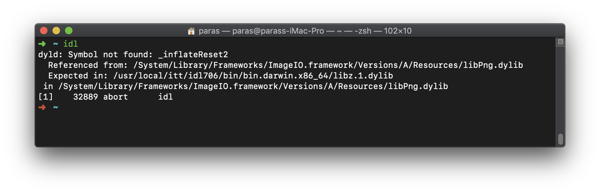

# Index

1. [Installing IDL](#installing-idl)
2. [Installing Exofastv2](#installing-exofastv2)
3. [Some Useful IDL Libraries](#some-useful-idl-libraries)


# Installing IDL

- ### **On Linux**

  Pre-installed libraries: `astron coyote clear cls` 

```shell
#Fixing  libXp.so.6
sudo apt install -y libxpm4 imagemagick
sudo ln -s /usr/lib/x86_64-linux-gnu/libXpm.so.4.11.0 \
/usr/lib/x86_64-linux-gnu/libXp.so.6

cd
wget -O idl_linux.tar.gz https://www.dropbox.com/s/bvs9wzpkue87vzy/idl_linux.tar.gz?dl=1
wget -O license.dat https://www.dropbox.com/s/d3p6paydwangq2c/license.dat?dl=1
sudo tar -xvf ./idl_linux.tar.gz --directory /usr/local/
sudo mv ./license.dat /usr/local/itt/license/
cd /usr/local/itt
sudo /usr/local/itt/install
```

<br>

- ### On Mac

  Pre-installed libraries: `astron coyote clear cls` 

```shell
brew cask install xquartz

cd
wget https://www.dropbox.com/s/dhdgvno47nx6o1b/idl_mac.tar.gz
sudo tar -xvf idl_mac.tar.gz --directory /usr/local/
cd /usr/local/itt
sudo chmod +x /usr/local/itt/install
sudo /usr/local/itt/install
```


:warning:**Fixing zlib issue**

If you encounter following error:



The execute following command to fix it.

```shell
sudo rm -rf /usr/local/itt/idl706/bin/bin.darwin.x86_64/libz.1.dylib
```

---

<br>

### **Installing Libraries**

If you have installed `idl` using instructions above skip this.

```shell
idl_libs=`readlink \`which idl\``
idl_libs="${idl_libs/\/bin\/idl/"/lib"}"

git clone https://github.com/Dishendramishra/coyote ./coyote
sudo mv ./coyote $idl_libs/
git clone https://github.com/Dishendramishra/IDLAstro ./astron
sudo mv ./astron $idl_libs/

wget https://raw.githubusercontent.com/Dishendramishra/idl_tutorial/master/libraries/clear.pro
sudo mv ./clear.pro $idl_libs/
wget https://raw.githubusercontent.com/Dishendramishra/idl_tutorial/master/libraries/cls.pro
sudo mv ./cls.pro  $idl_libs/
unset idl_libs
```


# **Installing Exofastv2**

```shell
cd $HOME/idl
git clone https://github.com/Dishendramishra/EXOFASTv2
```


Then execute following commands to define necessary paths in your `bash_profile` 

```shell
echo -e '\n' >> ~/.bash_profile
echo 'EXOFAST_PATH="$HOME/idl/EXOFASTv2/" ; export EXOFAST_PATH' >> ~/.bash_profile
echo '# if IDL_PATH is not defined, add EXOFAST_PATH and subdirectories to the default IDL path' >> ~/.bash_profile
echo 'if [ -z "$IDL_PATH" ]; then' >> ~/.bash_profile
echo 'IDL_PATH="<IDL_DEFAULT>:+${EXOFAST_PATH}" ; export IDL_PATH' >> ~/.bash_profile
echo 'else' >> ~/.bash_profile
echo '# otherwise, append EXOFAST_PATH and all subdirectories to your IDL_PATH' >> ~/.bash_profile
echo 'IDL_PATH="${IDL_PATH}:+${EXOFAST_PATH}" ; export IDL_PATH' >> ~/.bash_profile
echo 'fi' >> ~/.bash_profile

```

:warning: If you are another shell like `oh-my-zsh` then execute command given below:

```shell
echo "\n" >> ~/.zshrc
echo "source ~/.bash_profile" >>  ~/.zshrc
```

 

**Testing exofastv2**

```shell
cd $EXOFAST_PATH/examples/hat3
idl -e "fithat3"
```


# Some Useful IDL Libraries

| Name                                                         | Function                                             |
| ------------------------------------------------------------ | ---------------------------------------------------- |
| [CLEAR](https://climate.web.runbox.net/idl_lib/pro/clear.pro) | This procedure clears the active IDL display window. |
| [CLS](https://climate.web.runbox.net/idl_lib/pro/cls.pro)    | This procedure clears the IDL terminal window.       |

For more check **Dáithí** libraries https://climate.web.runbox.net/idl_lib/index.html

